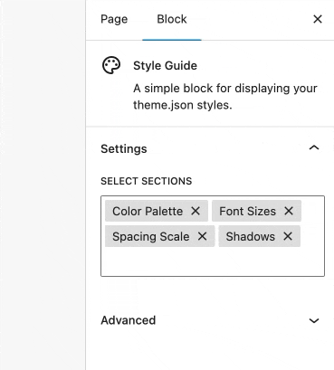

# Style Guide

Contributors: jsmith7
Tags: block, styles
Requires at least: 6.5
Tested up to: 6.7
Stable tag: 1.1.1
Requires PHP: 8.0
License: GPLv2 or later
License URI: https://www.gnu.org/licenses/gpl-2.0.html
GitHub Plugin URI: https://github.com/jeffreysmithart/style-guide

A simple block for displaying your block theme's style

## Installation

1. Download a zipped version of repo or clone it into your project.
2. Upload the plugin files to the `/wp-content/plugins/style-guide` directory.
3. Activate the plugin through the 'Plugins' screen in WordPress

## Screenshots

## Try it on WP Playground

[Try it on Playground](https://playground.wordpress.net/?blueprint-url=https://raw.githubusercontent.com/jeffreysmithart/style-guide/refs/heads/main/_playground/blueprint.json)

## Changelog

= 1.1.1 =

Add Github repo URL

= 1.1.0 =

- Styling update to provide a line height to detail summary text element.

= 1.0.0 =

- First verison of custom block

= 0.1.1 =

- Add missing screenshot

= 0.1.0 =

- Initial Commit
